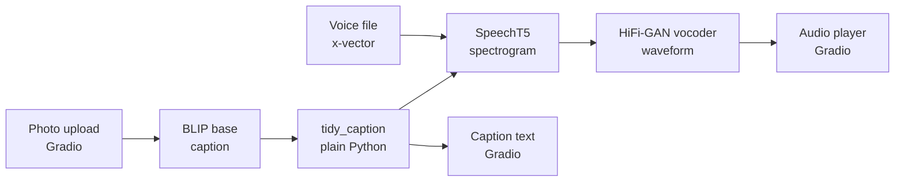

# Sightcast

Upload a photo, get a caption, then hear it read aloud. Built with open-source Hugging Face models (BLIP for captioning, SpeechT5 for speech) and a Gradio page. No paid APIs, no API keys, no Hugging Face token.

> A small project that runs in Google Colab. It is not production-grade: there are no tests, CI, Docker or deployment yet.

<!-- TODO: add a screenshot of the Gradio app: docs/sightcast-app.png -->

## How it works

1. You upload a photo in the Gradio page.
2. BLIP writes a one-sentence caption.
3. A plain Python step capitalises the caption and adds a full stop.
4. SpeechT5 turns the text into a spectrogram, using a speaker voice file.
5. A HiFi-GAN vocoder turns the spectrogram into a waveform.
6. The page shows the caption and an audio player.

## Run it

1. Click the Open in Colab button above.
2. Choose Runtime > Change runtime type > T4 GPU, then Save.
3. Choose Runtime > Run all. The first run downloads the models: about 1 GB for BLIP (measured), plus the speech model and vocoder (size not measured).
4. When the last cell finishes, the app appears under it. Upload a photo and click Submit.

Colab may print a temporary public link. Anyone with that link can use your running app, so do not share it. A warning that `HF_TOKEN` is not set is harmless, because these models need no token.

Environment used on 7 October 2026: Tesla T4 (15 GB), Python 3.13.15, transformers 5.18.0, torch 2.11.0+cu130, gradio 6.29.0, datasets 4.8.5. The notebook does not pin versions, so a newer Colab image may behave differently.

## Models

All are ungated and need no token or licence-acceptance page. Licences and gated status were checked on the Hugging Face Hub on 7 October 2026.

| Model | Job | Licence |
|---|---|---|
| `Salesforce/blip-image-captioning-base` | Image captioning | BSD-3-Clause |
| `microsoft/speecht5_tts` | Text to spectrogram | MIT |
| `microsoft/speecht5_hifigan` | Spectrogram to waveform | MIT |
| `Matthijs/cmu-arctic-xvectors` (dataset) | Speaker voice file (one `slt` voice) | MIT |

## Design decisions

- **Open and ungated only.** No accounts, tokens or paid services are needed to run the project.
- **Explicit model classes instead of `pipeline()`.** The transformers v5 docs disagreed about the name of the image-to-text pipeline and I could not confirm it, so the notebook uses `BlipProcessor` and `BlipForConditionalGeneration` directly.
- **Voice file read from the zip.** The voice dataset ships with a loading script, so the notebook downloads the zip and reads one file. I did not test whether `load_dataset` works on datasets 4.8.5.
- **A voice picked by name.** The first `slt` file in alphabetical order, not an index copied from a tutorial.
- **Flagging turned off** in the Gradio page, so nothing a user uploads is saved by the flag button.
- **Notebook first.** The working code is in one Colab notebook with outputs cleared, so no photos or temporary links are committed.

## Measured results

Single runs on a Colab T4 on 7 October 2026. These are first-run numbers, not averages.

| Step | Metric | Result | Note |
|---|---|---|---|
| BLIP load | Seconds | 26.5 | Includes the first download |
| BLIP caption | Seconds | 6.19 | First call, includes GPU warm-up |
| BLIP caption | GPU memory | 966 MB | Peak allocated |
| SpeechT5 and vocoder load | Seconds | Not measured | |
| SpeechT5 speech | Seconds | Not measured | |
| Any step on a CPU runtime | Seconds | Not measured | |

## Limitations

- Small captioning models can give short, generic captions and get details wrong. This is expected from earlier Colab work but not yet tested systematically here.
- English only, with one fixed voice that sounds slightly robotic.
- Colab only, and a GPU runtime is assumed. CPU speed has not been measured.
- No tests, CI, Docker or deployment.
- Library versions are not pinned in the notebook.
- The temporary Colab link is open to anyone who has it while the session runs.

## Roadmap

- Build a small evaluation set of my own photos and document the failure modes (miscounted objects, ignored text, generic captions).
- Measure warm timings and memory for both models on a T4 and on a CPU runtime.
- Move the code into the `src/sightcast` package with tests that use fake models, so tests never download a model.
- Pin dependencies with `uv.lock`, then add Ruff, mypy and GitHub Actions.
- Try a second speech model for comparison, such as Kokoro-82M (Apache-2.0).
- Docker and AWS EC2 later.

## Repository layout

- `notebooks/sightcast.ipynb`: the working app.
- `src/sightcast/`: a placeholder package from the uv project skeleton. The working code is in the notebook for now.
- `pyproject.toml` and `uv.lock`: uv project files, with no dependencies yet.

## Licence and credits

The code is MIT licensed (see `LICENSE`). The models keep their own licences, listed above. Built with models from Salesforce and Microsoft and the Hugging Face libraries.